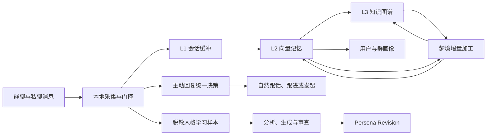

# Iris Memory - 三合一智能陪伴
> 面向 AstrBot 的轻量化三合一智能陪伴插件：记忆、主动回复、人格自学习迭代。

[](https://github.com/AstrBotDevs/AstrBot)
[](#许可证)

Iris Memory 用一个插件完成三件彼此关联的事：让机器人长期记住用户和群聊、在合适的时机自然参与对话，并从真实交流中安全地迭代指定 Persona。所有核心数据默认落在本地，昂贵模型调用前都有本地门控、增量判断或批处理。

## 核心能力

| 能力 | 作用 | 轻量化设计 |
| --- | --- | --- |
| 记忆 | L1 会话缓冲、L2 向量记忆、L3 知识图谱、用户/群画像 | FAISS + SQLite；分层注入预算；梦境任务增量加工 |
| 主动回复 | 跟话、跟进、主动发起、被动观察 | SignalGate 本地零 LLM 门控；单次统一决策；冷却与退避 |
| 人格自学习迭代 | 从指定群和用户的真实表达中迭代具名 Persona | 脱敏采样；分析/生成/审查分离；审批、冲突保护与非破坏性回滚 |

辅助能力包括图片理解、表达模式学习、错误消息友好化、Markdown 清理、数据备份以及 AstrBot Dashboard 管理页面。

## 为什么轻量

- 使用 `faiss-cpu`、SQLite 和 AstrBot KV，不依赖 ChromaDB、torch、transformers 等大型运行时。
- L1、L2、L3 分别设置注入预算，避免把全部历史直接塞入上下文。
- 主动回复先经过本地信号门控，只有候选事件才调用统一决策模型。
- 梦境任务采用零 LLM 时间锚定、共享近邻扫描、批量矛盾判断、增量知识归纳和批量 Embedding。
- 人格学习只把经过筛选、去重和脱敏的样本交给分析模型；生成和审查阶段不接触原始群聊语料。

## 安装前须知

1. 建议使用 AstrBot `>= 4.23.6`。
2. 不要与 `astrbot_plugin_iris_chat_memory` 或 `astrbot_plugin_iris_reply` 同时启用；功能存在重叠。
3. 必须将 AstrBot 的 `provider_ltm_settings.group_message_max_cnt` 设置为 `0`，由本插件统一管理上下文。否则可能出现重复注入和第三人称复述。
4. L2 默认需要一个 AstrBot Embedding Provider。使用本地 Embedding 时，需另行安装 `sentence-transformers`。
5. 从 v2 升级的用户先阅读 [迁移指南](./docs/MIGRATION.md)。

## 安装

在 AstrBot 插件市场安装 Iris Memory，或将本仓库放入 AstrBot 插件目录，然后重启 AstrBot。

插件会自动安装以下核心依赖：

- `faiss-cpu`
- `numpy`
- `tiktoken`
- `quart`
- `Pillow`
- `httpx`

## 快速开始

### 1. 配置记忆

在插件配置页完成以下设置：

1. 保持 `l1_buffer.enable`、`l2_memory.enable` 开启。
2. 将 `l2_memory.embedding_source` 保持为 `provider`。
3. 为 `l2_memory.embedding_provider` 选择 Embedding Provider。
4. 将 `provider_ltm_settings.group_message_max_cnt` 设置为 `0` 后重启。

使用管理员指令检查状态：

```text
/iris_mem l1 stats
/iris_mem l2 stats
```

### 2. 开启主动回复

在目标群聊中执行：

```text
/iris_reply enable
/iris_reply status
```

如需指定决策模型，可设置 `proactive.provider_id`。

### 3. 开启人格自学习迭代

1. 开启 `persona_evolution.enable`，配置分析/生成 Provider 和审查 Provider。
2. 在 AstrBot Dashboard 的 Iris Memory 页面创建人格迭代任务。
3. 指定目标 Persona、学习群和学习用户；内置 `default` Persona 需要先克隆。
4. 审阅生成的 Revision，批准后发布；需要时可从任意已应用版本非破坏性回滚。

默认自动触发条件为累计 100 条新增有效消息且距离上次成功至少 24 小时。手动执行仍需至少 20 条有效样本。完整流程见 [人格自学习迭代指南](./docs/PERSONA_EVOLUTION.md)。

## 三合一工作流



在线请求时，插件按预算注入 L1、L2、L3 和画像；离线任务负责总结、协调、知识归纳和清理。主动回复与人格学习复用同一消息入口，但各自拥有独立门控和存储边界。

## 记忆系统

### L1：近期上下文

三段式 FIFO 缓冲保存近期消息，并通过滚动总结进入 L2。当前用户消息会在注入时排除，避免重复上下文。

### L2：长期语义记忆

SQLite 保存内容和元数据，FAISS 保存向量索引。支持语义检索、persona 隔离、群记忆隔离以及基于时间、访问频率和置信度的遗忘评分。

### L3：知识图谱

以节点和边保存实体关系，通过关键词和 L2 来源记忆进行路径扩展。节点、边、提取与检索链路均支持 `persona_id` 隔离。

### 梦境增量加工

梦境任务由 5 个实际执行阶段组成，每个阶段有独立的新配置开关：

| 阶段 | 配置键 | 行为 |
| --- | --- | --- |
| 时间锚定 | `scheduled_tasks.dream_stage_temporal_anchor_enabled` | 用确定性规则把相对时间转为绝对日期，不调用 LLM |
| 记忆协调 | `scheduled_tasks.dream_stage_reconciliation_enabled` | 共享一次近邻扫描，完成重复合并和批量矛盾消解 |
| 知识归纳 | `scheduled_tasks.dream_stage_knowledge_induction_enabled` | 增量发现模式，并把 L2 实体关系提取到 L3 |
| L2 清理 | `scheduled_tasks.dream_stage_l2_pruning_enabled` | 按 persona 清理低价值向量记忆 |
| L3 维护 | `scheduled_tasks.dream_stage_l3_maintenance_enabled` | 每轮只执行一次全局图谱去重、孤儿清理和淘汰 |

旧版 6 个梦境子功能开关已移除且不会自动映射。升级后请按需要重新设置以上 5 个阶段开关，具体变更见 [CHANGELOG](./CHANGELOG.md)。

## 主动回复

主动回复支持四种动机：

- `chime_in`：话题相关时自然插话。
- `follow_up`：持续关注指定用户或话题。
- `initiate`：群聊长时间安静时主动发起话题。
- `watch`：只观察并更新对话锚点，不发言。

SignalGate 会先根据消息信号、冷却和静音时段进行本地判断。通过门控后，统一决策模型一次输出是否发言、内容、话题、关注对象、漂移和冷却建议。

常用指令：

```text
/iris_reply enable
/iris_reply disable
/iris_reply status
/iris_reply reset
/iris_reply cooldown [分钟]
/iris_reply willingness [低|中|高]
/iris_reply interjection [on|off]
/iris_reply initiate
```

受控工具偏好沿用现有人工批准链。用户只能在当前私聊提交候选或撤销自己的记录；候选批准前不会生效：

```text
/iris_preference request_memory
/iris_preference status
/iris_preference revoke
/iris_mem preference pending
/iris_mem preference approve <candidate_id>
/iris_mem preference status
/iris_mem preference revoke <candidate_id>
```

`request_memory` 只提交“明确回忆历史时提示已有只读记忆检索”的候选。批准后有效 7 天且不自动续期；本轮明确要求不联网、不要调用工具或不要检索时覆盖该提示。

## 人格自学习迭代

人格迭代采用受控 Revision 工作流：

1. 从管理员指定的群和用户采集真实表达。
2. 在本地执行拒绝规则、PII 脱敏、去重、限长和均衡抽样。
3. 分析表达特征，生成候选 Persona 变更。
4. 使用独立审查模型和确定性校验检查候选。
5. 根据配置自动发布或等待人工审批。
6. 保存完整 Run、Revision 和逐字 Diff，支持冲突处理与回滚。

默认仅维护 Persona 中的 `IRIS_EVOLUTION` 受控区块，避免覆盖管理员手写内容。任何外部编辑冲突都会停止自动发布。

管理指令：

```text
/iris_mem evolve status [job_id]
/iris_mem evolve run <job_id>
/iris_mem evolve pause <job_id>
/iris_mem evolve resume <job_id>
/iris_mem evolve rollback <job_id> <revision_id>
```

## 管理指令

`/iris_mem` 的基本格式为：

```text
/iris_mem <模块> <操作> [范围]
```

| 模块 | 常用操作 |
| --- | --- |
| `l1`、`l2`、`l3` | `stats`、`clear` |
| `profile` | `show`、`reset`、`group` |
| `learning` | 表达学习管理 |
| `evolve` | `status`、`run`、`pause`、`resume`、`rollback` |
| `all` | `clear` |

范围参数支持 `@用户`、`--group` 和 `--all`。执行 `/iris_mem help` 可查看当前版本的完整帮助。

插件还提供以下 Function Calling 工具：

- 记忆：`save_memory`、`search_memory`、`correct_memory`、`save_knowledge`、`search_knowledge_graph`、`get_profile`
- 主动回复：`add_follow_up`、`end_follow_up`、`set_cooldown`

## 配置

主要配置组如下：

| 配置组 | 用途 |
| --- | --- |
| `l1_buffer` | 近期上下文、总结和图片解析 |
| `l2_memory` | Embedding 来源、向量检索与注入 |
| `l3_kg` | 知识图谱和提取 Provider |
| `profile` | 用户/群画像和好感度 |
| `scheduled_tasks` | 梦境任务 Provider 与 5 个阶段开关 |
| `proactive` | 主动回复总开关、统计和决策 Provider |
| `persona_evolution` | 人格学习、生成、审查、采样与发布 |
| `learning` | 群聊表达模式学习 |
| `isolation_config` | 群记忆、画像与 persona 隔离 |
| `context_control` | AstrBot 上下文接管 |
| `error_friendly` | 错误消息友好化 |
| `markdown_stripper` | Markdown 输出清理 |

高级记忆参数保存在插件数据目录的 `hidden_config.json`，也可从 Dashboard 的“隐藏配置”页面编辑。主动回复高级参数由 Dashboard 管理并存储为 KV overrides。

默认上下文预算：L1 队列 4000 token、L2 注入 2000 token、L3 注入 600 token、单条记忆注入最多 300 字符。

## Dashboard

插件复用 AstrBot Dashboard 的鉴权与页面托管。在 Iris Memory 页面可以管理：

- L1、L2、L3 和画像
- 主动回复开关、统计和高级参数
- 表达模式学习
- 人格迭代任务、Run、Revision、审批与回滚
- 数据导入导出、运行日志和隐藏配置

## 数据与隐私

- L2、L3、画像和人格迭代记录默认保存在本地 SQLite / FAISS 数据目录。
- 主动回复状态和高级配置保存在 AstrBot KV。
- 只有调用所配置的 LLM 或 Embedding Provider 时，必要文本才会发送到对应服务。
- 人格学习原始样本仅进入风格分析阶段；生成和审查阶段只接收结构化结果。
- 可通过 Dashboard 或管理指令按用户、群或全局删除数据。

请根据所使用 Provider 的隐私政策和所在地区法规决定是否启用相关云端能力。

## 从 v2 迁移

首次启动 v3 时，插件会尝试一次性迁移旧 ChromaDB 记忆、知识图谱、画像、主动回复白名单和部分旧配置，并在迁移前备份到 `<数据目录>/legacy_backup/`。

旧 ChromaDB 记忆迁移需要额外安装 `chromadb`；未安装时只跳过 L2 迁移，不阻塞插件启动。详细步骤、验证和回滚方式见 [v2 → v3 迁移指南](./docs/MIGRATION.md)。

梦境阶段开关属于本轮重构后的新配置，不参与旧 6 开关迁移。

## 常见问题

### 记忆没有注入，或者机器人用第三人称复述自己

确认 `provider_ltm_settings.group_message_max_cnt = 0`，然后重启 AstrBot。内置上下文与 Iris Memory 同时注入会造成重复信息。

### L2 没有检索结果

确认 `l2_memory.enable=true`、Embedding Provider 可用，并使用 `/iris_mem l2 stats` 检查是否已有记忆。之后再调整 `relevance_threshold` 或 `top_k`。

### 主动回复没有发言

使用 `/iris_reply status` 检查群开关、冷却和静音时段。需要时调整 willingness，并在 Dashboard 查看决策统计。

### 主动回复过于频繁

降低 willingness，延长冷却，或在 Dashboard 调整 backoff、boost 和静音时段。

### 人格迭代任务显示 conflict

目标 Persona 在任务基线之外被人工或其他插件修改。为避免覆盖外部编辑，自动发布会停止。请在 Dashboard 审阅并采纳当前 Persona 为新基线，或人工处理冲突后恢复任务。

## 开发与测试

```bash
python -m pip install -r requirements.txt -r requirements-dev.txt
python -m pytest -q
```

提交 Pull Request 前，请确保测试通过、没有提交本地数据文件，并在涉及配置或用户行为变更时同步更新 CHANGELOG。

## 文档

- [更新日志](./CHANGELOG.md)
- [v2 → v3 迁移指南](./docs/MIGRATION.md)
- [人格自学习迭代指南](./docs/PERSONA_EVOLUTION.md)
- [Web 前端开发说明](./iris_memory/web/README.md)
- [AstrBot 插件开发文档](https://docs.astrbot.app/dev/star/plugin-new.html)

## 贡献

欢迎通过 Issue 报告问题或提出建议，也欢迎提交 Pull Request。请在问题描述中附上 AstrBot 版本、插件版本、关键配置和脱敏后的日志。

## 许可证

本项目采用 AGPL-3.0 许可证。
